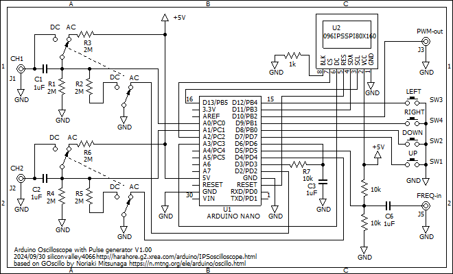

# ArduinoIPSOscilloscope
Arduino 0.96-inch 80x160 LCD dual channel oscilloscope with 16Msps equivalent time sampling, Pulse Generator and Frequency Counter

This displays an oscilloscope screen on a 0.96-inch 80x160 LCD. The settings are controled by 4 tactile switches or the 5 direction switch. It contains Pulse Generator, Frequency Counter.

Specifications: 
Dual input channel 
Input voltage range 0 to 5.0V 
10 bit ADC 307ksps single channel, 16.7ksps dual channel 
equivalent-time sampling rate up to 16Msps 
Measures minimum, maximum and average values 
Measures frequency and duty cycle 
Spectrum FFT analysis 
Sampling rate selection 
Built in Pulse Generator 
Built in Frequency Counter up to 6MHz 

Develop environment is: 
Arduino IDE 1.8.19

Libraries: 
Adafruit_ST7735_and_ST7789_Library 
FreqCount 
fix_fft 

Schematics: 

Description is here, although it is written in Japanese language: http://harahore.g2.xrea.com/arduino/IPSGOscillo.html
