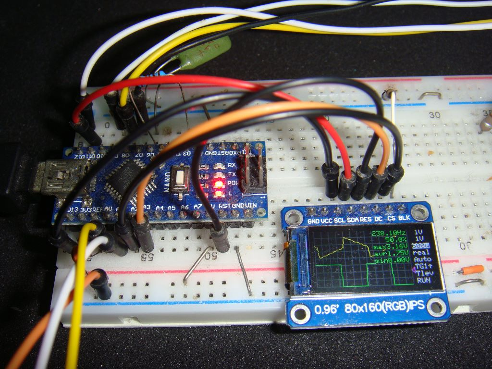

# ArduinoIPSOscilloscope
Arduino 0.96-inch 80x160 LCD dual channel oscilloscope with 16Msps equivalent time sampling, Pulse Generator and Frequency Counter

This displays an oscilloscope screen on a 0.96-inch 80x160 LCD. The settings are controled by 4 tactile switches or the 5 direction switch. It contains Pulse Generator, Frequency Counter.

Specifications: 
<li>Dual input channel</li>
<li>Input voltage range 0 to 5.0V</li>
<li>10 bit ADC 307ksps single channel, 16.7ksps dual channel</li>
<li>equivalent-time sampling rate up to 16Msps</li>
<li>Measures minimum, maximum and average values</li>
<li>Measures frequency and duty cycle</li>
<li>Spectrum FFT analysis</li>
<li>Sampling rate selection</li>
<li>Built in Pulse Generator</li>
<li>Built in Frequency Counter up to 6MHz</li>
 

Develop environment is: 
Arduino IDE 1.8.19

Libraries: 
Adafruit_ST7735_and_ST7789_Library 
FreqCount 
fix_fft 

Schematics: 

Description is here, although it is written in Japanese language: http://harahore.g2.xrea.com/arduino/IPSGOscillo.html
